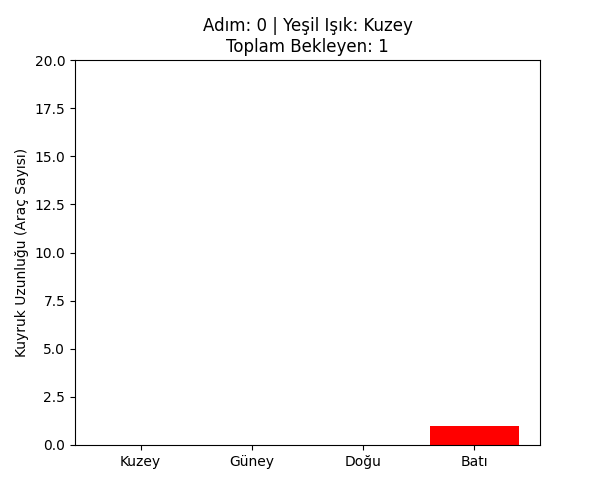
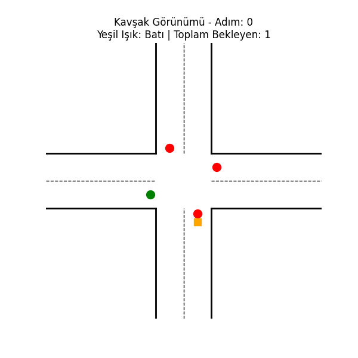

# Pekiştirmeli Öğrenme Tabanlı Adaptif Trafik Sinyalizasyonu Optimizasyonu

## Özet (Abstract)
Şehir içi trafik sıkışıklığı artan araç sayısı ile birlikte günümüzün en büyük problemlerinden biri haline gelmiştir. Geleneksel sabit zamanlı (fixed-time) trafik ışığı sistemleri anlık trafik yoğunluğundaki değişimlere uyum sağlayamadıkları için optimum geçiş verimliliğini sunamazlar. Bu çalışmada kavşaklardaki kameralardan veya sensörlerden elde edilen anlık araç kuyruk uzunluklarına göre yeşil ışık fazlarını dinamik olarak ayarlayan bir **Pekiştirmeli Öğrenme (Reinforcement Learning - RL)** modeli geliştirilmiştir. Çalışma sonucunda eğitilen Q-Learning ajanı klasik sabit zamanlı sistemlere göre toplam bekleme sürelerinde ortalama **%24 oranında iyileşme** sağlamıştır.

---

## 1. Giriş
Trafik sinyalizasyonunun temel amacı farklı yönlerden gelen araçların bir kavşağı güvenli ve en az gecikmeyle geçmesini sağlamaktır. Sabit fazlı sistemler günün belirli saatlerine göre programlansa dahi anlık yığılmalara cevap veremez. Bu proje bir yapay zeka ajanının kavşaktaki trafik durumunu "gözlemlemesi" ve hangi yöne geçiş hakkı vereceğine "deneme-yanılma" yoluyla karar vermesini hedefleyen adaptif bir yaklaşım sunmaktadır.

## 2. Yöntem (Methodology)

### 2.1. Simülasyon Ortamı (Environment)
Gerçek dünya kavşak dinamiklerini modellemek amacıyla özel bir simülasyon ortamı (`IntersectionEnv`) geliştirilmiştir. Kavşak -> Kuzey, Güney, Doğu ve Batı olmak üzere 4 ana yaklaşımdan oluşmaktadır.
- **Araç Gelişi:** Araçların kavşağa varışı rassal bir süreçtir ve her yön için ayrı ayrı Poisson dağılımı ile modellenmiştir.
- **Araç Ayrılışı:** Sadece yeşil ışığın yandığı yöndeki araçlar kavşaktan ayrılabilir.

### 2.2. Pekiştirmeli Öğrenme Modeli (MDP Formülasyonu)
Problem bir Markov Karar Süreci (MDP) olarak ele alınmıştır.
- **Durum (State, $S$):** Kavşağa yaklaşan 4 yöndeki (K, G, D, B) anlık araç kuyruk uzunlukları. Q-Learning algoritmasının bellek karmaşıklığını yönetebilmek adına kuyruk uzunlukları ayrıklaştırılarak (discretized) sınırlandırılmıştır.
- **Eylem (Action, $A$):** Trafik güvenliği gereği her bir yönün bağımsız olarak kontrol edildiği 4 farklı faz (Kuzey Yeşil, Güney Yeşil, Doğu Yeşil, Batı Yeşil). Her adımda yalnızca bir faz aktif olabilir.
- **Ödül (Reward, $R$):** Ajanın amacı toplam bekleme süresini (kuyruktaki araç sayısını) minimize etmektir. Bu nedenle ödül fonksiyonu 4 yöndeki toplam araç sayısının negatif değeri ($R = -\sum Q_i$) olarak tanımlanmıştır.

### 2.3. Q-Learning Ajanı
Ajanın eğitimi için modelden bağımsız (model-free) bir algoritma olan **Q-Learning** kullanılmıştır. Keşif-sömürü (exploration-exploitation) dengesini kurmak için $\epsilon$-greedy (epsilon-greedy) politikası uygulanmış olup eğitim ilerledikçe rastgele eylem seçme ihtimali ($\epsilon$) kademeli olarak düşürülmüştür.

---

## 3. Bulgular ve Tartışma (Results)

Model 1000 bölüm (episode) boyunca eğitilmiş ve her bölümde ajanın aldığı toplam ödül (negatif bekleme süresi) kaydedilmiştir. Eğitim süresince ajan hangi kuyruk kombinasyonlarında hangi fazı aktif etmesi gerektiğini öğrenerek ödülünü maksimize etmiş (sıfıra yaklaştırmış) ve kararlı bir politikaya (converge) ulaşmıştır.

Test aşamasında; eğitilmiş RL ajanı ile fazların periyodik olarak sırayla değiştiği (her 5 adımda bir) Sabit Zamanlı Sistem 100 bölüm boyunca karşılaştırılmıştır.
- **Sabit Zamanlı Sistem Ortalama Bekleme:** ~1150 araç-adım
- **RL Adaptif Sistem Ortalama Bekleme:** ~875 araç-adım
- **Genel İyileşme:** **~%24**

RL tabanlı adaptif sistem yığılma olan yönleri önceliklendirerek sistemin toplam yükünü başarılı bir şekilde hafifletmiştir.

### Simülasyon Animasyonları

Aşağıdaki ilk animasyon kuyruk uzunluklarının çubuk grafik üzerinden değişimini, ikinci animasyon ise kavşağın kuşbakışı (grid) görünümünü temsil etmektedir. Kırmızı renk beklemeyi, yeşil renk ise o yöne geçiş hakkı verildiğini ifade eder.

**1. Çubuk Grafik Simülasyonu**



**2. Kuşbakışı Kavşak Simülasyonu**



---

## 4. Sonuç ve Gelecek Çalışmalar
Bu proje Reinforcement Learning tekniklerinin trafik kontrolünde ne denli etkili olabileceğini basit ve modüler bir mimari ile kanıtlamıştır. Gelecek çalışmalarda sistem şu özelliklerle geliştirilebilir:
1. **Derin Pekiştirmeli Öğrenme (Deep RL - DQN vb.):** Ayrıklaştırılmış durum uzayı yerine sürekli (continuous) durumu işleyebilmek.
2. **Kavşak Ağları:** Tek bir kavşak yerine birbirine bağlı birden fazla kavşağın Çoklu Ajanlı (Multi-Agent) RL ile optimize edilmesi.
3. **Şerit Detayları:** Sağa veya sola dönüş şeritleri ile yaya geçitlerinin modele dahil edilmesi.

---

## 5. Kurulum ve Kullanım

Proje standart Python kütüphaneleri kullanılarak geliştirilmiştir.

**Gereksinimler:**
```bash
pip install numpy matplotlib
```

**Çalıştırma:**
```bash
python main.py
```
Komut çalıştırıldıktan sonra ajan eğitilecek test sonuçları konsola yazdırılacak ve simülasyon çıktıları (`sonuclar.png`, `simulation.gif`, `grid_simulation.gif`) klasöre kaydedilecektir.
